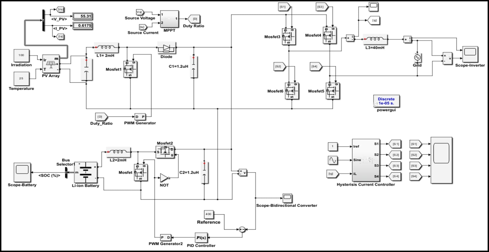
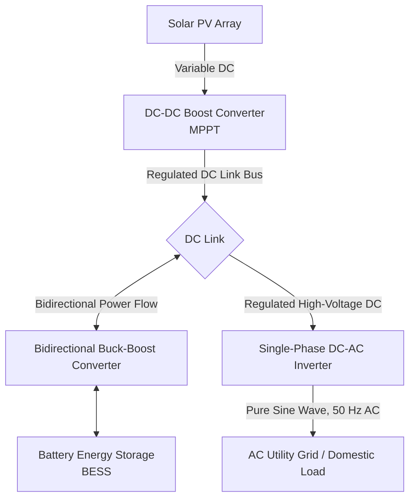
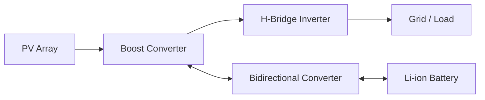
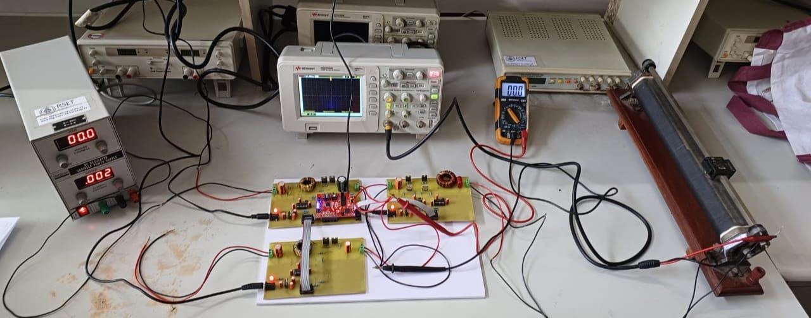
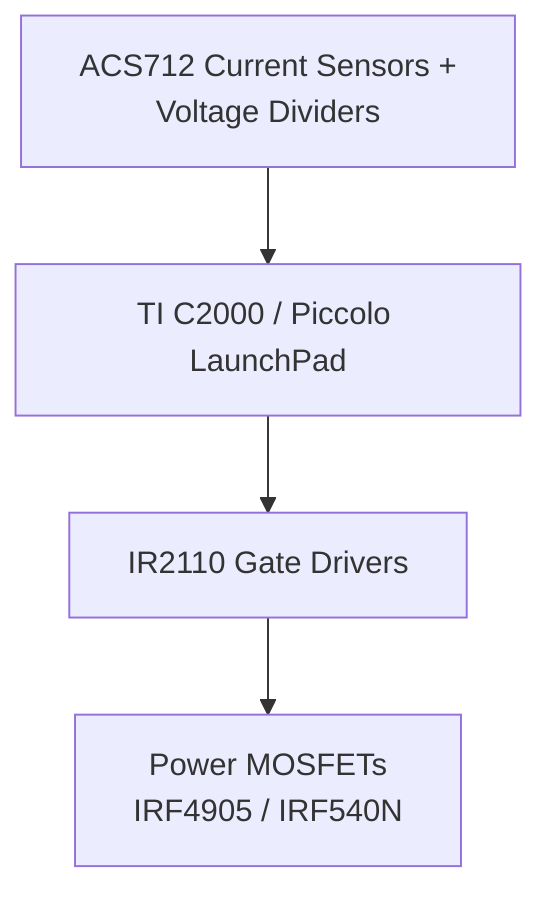

# Islandable Hybrid Solar Microgrid — Design, Simulation & Hardware Prototype

A single-phase hybrid microgrid that can operate grid-tied or seamlessly island during outages — combining solar MPPT harvesting, bidirectional battery storage, and grid-synchronized inversion, validated through MATLAB/Simulink simulation and a physical hardware prototype built around a TI C2000 Piccolo controller.

## Motivation

Residential solar systems typically force a trade-off between two architectures:

- **Grid-Tied (On-Grid)** — exports surplus power and benefits from net metering, but shuts down during blackouts to prevent backfeeding into the grid.
- **Standalone (Off-Grid)** — fully independent, but requires oversized battery banks and a backup diesel generator to cover peak demand or extended bad weather.

This project merges both into an **Islandable Microgrid**: it operates synchronized to the grid under normal conditions (importing or exporting as needed) but disconnects cleanly into islanded mode during outages. Having grid access as a backup allows the battery bank to be downsized, cutting installation cost and removing the need for a fossil-fuel generator, while a self-consumption strategy prioritizes the local battery and household loads before exporting excess energy.

## System Architecture

### Simulink Model

*Complete closed-loop model: PV array, boost/buck-boost converters, H-bridge inverter, and the three control loops (MPPT, voltage regulation, hysteresis current control).*

Three converter stages, anchored by a central DC link, handle the physical power flow:

1. **Solar Harvesting (Unidirectional DC-DC)** — extracts maximum available solar power regardless of irradiance or temperature swings, and steps it up onto the DC bus.
2. **Battery Interfacing (Bidirectional DC-DC)** — bucks DC-link voltage down to charge the battery during solar surplus, and boosts battery voltage back onto the link when sunlight fades or demand peaks.
3. **Grid/Load Interfacing (DC-AC Inverter)** — inverts the stable DC-link voltage into clean single-phase AC (230 V, 50 Hz) synchronized to grid standards.

## Subsystem Design

### A. Solar Boost Converter & MPPT

PV output voltage/current is non-linear and fluctuates with irradiance and temperature, so a boost converter steps the variable input up to a regulated intermediate voltage.

**Design specifications:**

| Parameter | Value |
|---|---|
| Nominal input voltage (V_in) | 17 V |
| Regulated output voltage (V_out) | 24 V |
| Nominal output current (I_out) | 2 A |
| Switching frequency (f_s) | 50 kHz |

**Allowable inductor ripple current** (20% of output current, reflected to input):

$$\Delta I_l = \frac{0.2 \times I_{out} \times V_{out}}{V_{in}} = \frac{0.2 \times 2 \times 24}{17} = 0.5\ \text{A}$$

**Inductor sizing:**

$$L = \frac{V_{in} \times (V_{out} - V_{in})}{\Delta I_l \times f_s \times V_{out}} = \frac{17 \times (24 - 17)}{0.5 \times 50000 \times 24} \approx 120\ \mu\text{H}$$

*(Prototype hardware uses an upgraded 2 mH inductor for further ripple suppression.)*

**Duty ratio** (accounting for a real-world 0.8 efficiency scaling factor):

$$D = 1 - \frac{V_{in} \times 0.8}{V_{out}} = 1 - \frac{17 \times 0.8}{24} = 0.43$$

**Output filter capacitor:**

$$C_{out} = \frac{I_{out} \times D}{f_s \times \Delta V_{out}} = 0.7\ \mu\text{F}$$

### B. Bidirectional Battery Converter

Unlike the unidirectional solar stage, the battery interface must support two-way current flow:

- **Buck Mode (Charging)** — when solar production exceeds household consumption, surplus DC-link energy is stepped down into the battery.
- **Boost Mode (Discharging)** — when irradiance drops or demand surges, the converter reverses direction, boosting stored battery energy back onto the DC link.

### C. DC-AC Inverter Stage

A full-bridge (H-bridge) single-phase inverter chops the steady DC link into an alternating-polarity waveform. This passes through an LC filter (40 mH choke + filter capacitors) to produce a low-distortion 50 Hz sine wave suitable for domestic AC loads and grid synchronization.

## Control System Architecture

Three control loops govern the system, all modeled and verified in MATLAB/Simulink before hardware fabrication:

| Control Loop | Function |
|---|---|
| **MPPT Control** | Senses PV voltage (ADC gain 36.5/4096) and current (3.3/4096); computes P = V × I and adjusts boost-switch PWM duty cycle (ePWM1) to track the Maximum Power Point |
| **Bidirectional Voltage Regulation** | Senses DC output voltage against a 24 V setpoint; a discrete PI controller (PI(z)) produces gating signals (ePWM3) to regulate charge/discharge |
| **Inverter SPWM / Hysteresis Current Control** | Compares a reference sine wave against grid current feedback (i_L) in a hysteresis controller to generate H-bridge gate signals (S1–S4) |

## Simulation Results

- **DC Link Voltage Stability** — the bidirectional converter locks the DC bus at 400 V within 0.03 s of startup, with no transient settling oscillations.
- **AC Output Quality** — the inverter produces a stable single-phase sinusoidal output (~325 V peak / 230 V RMS) with in-phase output current at 50 Hz.
- **Battery Dynamics** — under 100 W discharge, SOC shows a steady, controlled linear decline; under 1000 W solar surplus charging, SOC ramps up cleanly, confirming correct bidirectional charge regulation.

*(Add your Simulink SOC/voltage plots here, e.g. ``)*

## Hardware Implementation

### Physical Prototype

*Bench prototype: TI C2000 Piccolo controller, gate driver board, MOSFET power stage, and sensor wiring.*

- **Microcontroller/DSP Core** — TI C2000 Piccolo digital signal controller, executing real-time control via C2802x/ePWM blocks.
- **Gate Driver Isolation** — since 3.3 V logic pins can't switch high-current MOSFET gates directly, IR2110 high-/low-side drivers (12 V) with bootstrap diodes/capacitors handle floating high-side switching.
- **Semiconductor Switches** — IRF4905 (P-channel) in the DC-DC converter stages; IRF540N (N-channel) configured in an H-bridge for the inverter.
- **Sensing** — Allegro ACS712 Hall-effect current sensors (ACS712xLCTR-05B) plus precision resistive dividers for bus voltage sensing.
- **Power Conditioning** — L7805 (+5 V) and AP1117 (+3.3 V) linear regulators supply clean analog/digital rails.

**Bench result:** the physical prototype produced a stable, low-noise sinusoidal AC waveform at 50.26 Hz on the oscilloscope, with a peak-to-peak amplitude of 49.6 V during initial low-voltage bench testing — matching domestic grid frequency standards.

*(Add your oscilloscope capture here, e.g. ``)*

## Technical Specifications Summary

| Parameter | Prototype (Hardware) | Simulation Reference |
|---|---|---|
| System classification | Single-phase islandable hybrid microgrid | Grid-connected / standalone model |
| Solar input voltage | 17 V DC nominal | PV array block, 1000 W/m², 25°C |
| Regulated DC link | 24 V DC | 400 V DC (high-voltage model) |
| Switching frequency | 50 kHz | Discrete fixed-step solver, 10 µs |
| Boost inductor/choke | 120 µH (calc) / 2 mH (proto) | 2 mH / 40 mH |
| AC output frequency | Measured: 50.26 Hz | Nominal: 50.0 Hz |
| Control unit | TI C2000 Piccolo | Embedded MATLAB / C2802x target blocks |
| Gate driver | IR2110 | Direct discrete logic PWM generator |

## for detailed  review do contact
